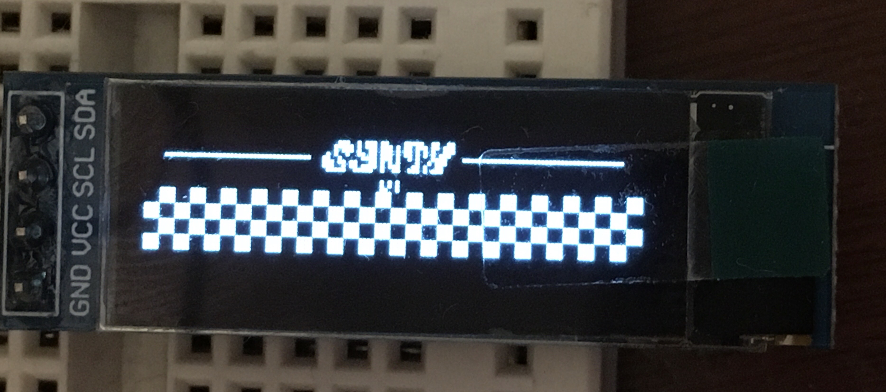

# MSP430 OLED Controller
Driver code for MSP430 microcontroller to control SSD1306 OLED.

Derived from [Jan Rychter's implementation](https://jan.rychter.com/enblog/msp430-i2c-usi-library-released) [(code)](https://github.com/jwr/msp430_usi_i2c)

# Features

- Tiny
- Simple
- Supports sending one byte over in a loop a certain number of times

It is smaller than Jan's original work because it doesn't implement reading from the I2C device (not needed when communicating with an OLED anyways). It drops the 16-bit bus pirate convention in favour of a 8-bit payload stream. It also more closely suits the needs of the SSD1306, always sending the I2C address, a control byte, followed by the payload, which simplifies the implementation slightly.

The ability to send one byte in a loop a specific number of times is useful when communicating with the OLED. For example, when attempting to clear the screen. This was not possible in Jan's code without instantiating a long buffer of 16-bit integers. (In the case of clearing the screen, 128 * 2 = 256 bytes = 1/8 of the MSP430G2231's entire available flash!) I added this functionality so that sending the same byte in a loop uses the same amount of memory as if you had only sent it once.

Tested on the MSP430G2231.

# Usage

- call `void oc_init(...)` to initialize the controller.
- call one of the `void oled_send_x(...)` functions to send a command or data.
- alternatively, call `void oc_send(...)` for lower level control.

# Example (main.c)

